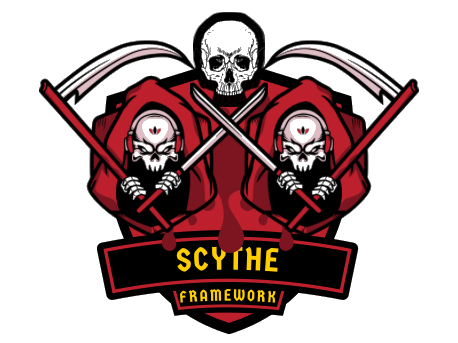

<h1 align="center">Scythe</h1>

<h2 align="center">
  
  <br>
</h2>

<h4 align="center">A comprehensive framework for adverse conditions testing</h4>

## Overview

Scythe is a powerful Python-based framework designed for testing applications under adverse conditions. Whether you're conducting security assessments, load testing, functional validation, or simulating real-world stress scenarios, Scythe provides the tools to comprehensively evaluate how your systems perform when faced with challenging conditions.

While security testing through Tactics, Techniques, and Procedures (TTPs) is a core capability, Scythe's scope extends far beyond traditional security assessments. It's built to handle any scenario where you need to test system resilience, validate expected behaviors under stress, or simulate complex user interactions at scale.

## Core Philosophy

Scythe operates on the principle that robust systems must be tested under adverse conditions to ensure they perform reliably in production. These conditions can include:

- **Security-focused adversarial testing**: Simulating attack patterns and malicious behavior
- **High-demand load testing**: Overwhelming systems with legitimate but intensive usage
- **Complex user workflow validation**: Multi-step processes under various conditions
- **Distributed testing scenarios**: Simulating global user bases and network conditions
- **Edge case exploration**: Testing boundary conditions and unusual usage patterns
- **Failure scenario simulation**: Understanding system behavior when components fail

## Key Capabilities

### **Comprehensive Testing Framework**
* **TTPs (Tactics, Techniques, Procedures)**: Security-focused testing with adversarial patterns
  * **Login Brute-Force**: Test authentication security controls
  * **SQL Injection**: Test input validation (form fields, URL parameters, path manipulation)
  * **CSRF Validation**: Verify CSRF protection enforcement
  * **Request Flooding**: Test DDoS resilience and rate limiting
  * **UUID Guessing**: Test resource enumeration protections
* **Dual Execution Modes**: UI mode (Selenium) and API mode (direct HTTP requests)
* **Journeys**: Multi-step workflow testing for complex user scenarios (UI and API modes)
* **Expected Results System**: Unit-testing-style validation with clear pass/fail criteria
* **Behavior Patterns**: Human, machine, and stealth execution patterns
* **Payload Generators**: Wordlist and static payload generation for testing
* **Extensible Architecture**: Easy to add custom testing scenarios

### **Authentication & Session Management**
* **Multiple Authentication Methods**: Basic auth, bearer tokens, cookie-based JWT, custom mechanisms
* **Pre-execution Authentication**: Automatic login before test execution
* **Session State Management**: Maintain authentication across complex workflows
* **Multi-user Simulation**: Different credentials for distributed testing
* **CSRF Protection Support**: Automatic CSRF token extraction and injection for protected APIs

### **Scale & Distribution**
* **Concurrent Execution**: Run thousands of tests simultaneously
* **Geographic Distribution**: Execute tests from multiple network locations
* **Batch Processing**: Divide large test runs with intelligent retry logic
* **Resource Management**: Efficient distribution of credentials and network resources
* **Multiple Execution Strategies**: Sequential, parallel, and distributed patterns

### **Professional Reporting**
* **Clear Result Indicators**: Expected and unexpected outcomes
* **Comprehensive Logging**: Detailed execution tracking and analysis
* **Version Detection**: Automatic extraction of X-SCYTHE-TARGET-VERSION headers
* **Performance Metrics**: Timing, success rates, and resource utilization
* **Execution Statistics**: Detailed reporting across all test types

## Use Cases

### Security Testing
Validate security controls and detection capabilities:

**Login Brute-Force Protection:**
```python
from scythe.ttps.web.login_bruteforce import LoginBruteforceTTP
from scythe.payloads.generators import WordlistPayloadGenerator

# Test that brute-force protection works
login_protection_test = LoginBruteforceTTP(
    payload_generator=WordlistPayloadGenerator("common_passwords.txt"),
    username="admin",
    api_endpoint="/api/login",
    expected_result=False,  # Security should prevent this
    execution_mode='api'
)
```

**CSRF Protection Validation:**
```python
from scythe.ttps.web.csrf_validation import CSRFValidationTTP
from scythe.core.csrf import CSRFProtection

csrf = CSRFProtection(cookie_name='csrftoken', header_name='X-CSRFToken')
csrf_test = CSRFValidationTTP(
    target_endpoints=['/api/users', '/api/posts'],
    http_method='POST',
    csrf_protection=csrf,
    expected_result=True  # Expect CSRF to be enforced
)
```

**SQL Injection Protection:**
```python
from scythe.ttps.web.sql_injection import InputFieldInjector
from scythe.payloads.generators import StaticPayloadGenerator

sql_payloads = StaticPayloadGenerator([
    "' OR '1'='1",
    "'; DROP TABLE users--"
])
sql_test = InputFieldInjector(
    field_selector="#search",
    submit_selector="#submit",
    payload_generator=sql_payloads,
    expected_result=False,  # Should be prevented
    execution_mode='ui'
)
```

### Load Testing
Assess system performance under high demand:
```python
# Simulate 1000 concurrent user registrations
registration_load_test = ScaleOrchestrator(
    name="User Registration Load Test",
    max_workers=50
)
result = registration_load_test.orchestrate_journey(
    journey=user_registration_journey,
    replications=1000
)
```

### Functional Validation
Test complex multi-step workflows:
```python
# Complete e-commerce purchase workflow
purchase_journey = Journey("E-commerce Purchase Flow")
purchase_journey.add_step(user_login_step)
purchase_journey.add_step(product_selection_step)
purchase_journey.add_step(checkout_process_step)
purchase_journey.add_step(payment_validation_step)
```

### Distributed Testing
Simulate global user base scenarios:
```python
# Test from multiple geographic locations
global_test = DistributedOrchestrator(
    name="Global User Simulation",
    proxies=worldwide_proxy_list,
    credentials=regional_user_accounts
)
```

### Edge Case Testing
Explore boundary conditions and unusual scenarios:

**SQL Injection Testing:**
```python
from scythe.ttps.web.sql_injection import InputFieldInjector, URLManipulation
from scythe.payloads.generators import StaticPayloadGenerator

# Test form input fields
sql_payloads = StaticPayloadGenerator([
    "' OR '1'='1",
    "'; DROP TABLE users--",
    "1' UNION SELECT * FROM users--"
])

form_sql_test = InputFieldInjector(
    field_selector="#search",
    submit_selector="#submit",
    payload_generator=sql_payloads,
    expected_result=False,  # Should be prevented
    execution_mode='ui'
)

# Test URL parameters (API mode)
url_sql_test = URLManipulation(
    payload_generator=sql_payloads,
    api_endpoint="/api/search",
    http_method="GET",
    expected_result=False,
    execution_mode='api'
)
```

**Request Flooding / DDoS Testing:**
```python
from scythe.ttps.web.request_flooding import RequestFloodingTTP

# Test rate limiting and DDoS resilience
flooding_test = RequestFloodingTTP(
    target_endpoints=["/api/search", "/api/users"],
    request_count=1000,
    requests_per_second=50.0,
    attack_pattern="volume",  # or 'slowloris', 'burst', 'resource_exhaustion'
    concurrent_threads=10,
    expected_result=False,  # Expect rate limiting to kick in
    execution_mode='api'
)

executor = TTPExecutor(ttp=flooding_test, target_url="http://app.com")
executor.run()

# Get detailed attack summary
summary = flooding_test.get_attack_summary()
print(f"Success rate: {summary['success_rate']:.1f}%")
print(f"Rate limit rate: {summary['rate_limit_rate']:.1f}%")
print(f"Defense assessment: {summary['defense_assessment']}")
```

**CSRF Validation Testing:**
```python
from scythe.ttps.web.csrf_validation import CSRFValidationTTP
from scythe.core.csrf import CSRFProtection

csrf = CSRFProtection(
    cookie_name='csrftoken',
    header_name='X-CSRFToken'
)

# Validate CSRF protection is enforced
csrf_validation = CSRFValidationTTP(
    target_endpoints=['/api/users', '/api/posts', '/api/delete'],
    http_method='POST',
    test_payload={'action': 'delete'},
    csrf_protection=csrf,
    expected_result=True  # Expect CSRF to be enforced
)

executor = TTPExecutor(ttp=csrf_validation, target_url="http://app.com")
executor.run()

# Get validation summary
summary = csrf_validation.get_validation_summary()
print(f"Endpoints protected: {summary['endpoints_protected']}")
print(f"Overall result: {summary['overall_result']}")
```

**UUID Guessing:**
```python
from scythe.ttps.web.uuid_guessing import GuessUUIDInURL
from scythe.payloads.generators import StaticPayloadGenerator
from uuid import uuid4

# Generate UUID payloads
uuid_payloads = StaticPayloadGenerator([
    str(uuid4()) for _ in range(100)  # Generate 100 random UUIDs
])

uuid_test = GuessUUIDInURL(
    target_url="http://app.com",
    uri_root_path="/api/resource/",
    payload_generator=uuid_payloads,
    expected_result=False  # Should not find valid resources
)
```

## Getting Started

### Prerequisites
- Python 3.8+
- Google Chrome browser
- Network access for target testing

### Installation

#### If you would like to use as a library:

Set up the virtual environment
```bash
python3 -m venv venv

# source the venv
# bash,zsh: source venv/bin/activate
# fish: source venv/bin/activate.fish
```

Install the package
```bash
# in an activated venv

pip3 install scythe-ttp
```

#### If you would like to contribute:

1. Clone the repository:
   ```bash
   git clone https://github.com/EpykLab/scythe.git
   cd scythe
   ```

2. Install dependencies:
   ```bash
   pip install -r requirements.txt
   ```

3. Verify installation:
   ```bash
   python -c "from scythe.core.ttp import TTP; print('Scythe installed successfully')"
   ```

## Quick Start Examples

### 1. Basic Security Testing

Test authentication controls with expected failure:

**UI Mode (Selenium-based):**
```python
from scythe.core.executor import TTPExecutor
from scythe.ttps.web.login_bruteforce import LoginBruteforceTTP
from scythe.payloads.generators import StaticPayloadGenerator

# Create a security test expecting controls to work
security_test = LoginBruteforceTTP(
    payload_generator=StaticPayloadGenerator(["password", "123456", "admin"]),
    username="admin",
    username_selector="#username",
    password_selector="#password",
    submit_selector="#submit",
    expected_result=False,  # We EXPECT security to prevent this
    execution_mode='ui'  # Default: uses Selenium
)

executor = TTPExecutor(ttp=security_test, target_url="http://app.com/login")
executor.run()
print(f"Test passed: {executor.was_successful()}")
```

**API Mode (Direct HTTP requests):**
```python
from scythe.core.executor import TTPExecutor
from scythe.ttps.web.login_bruteforce import LoginBruteforceTTP
from scythe.payloads.generators import StaticPayloadGenerator
from scythe.core.csrf import CSRFProtection

# Configure CSRF protection for API mode
csrf = CSRFProtection(
    cookie_name='csrftoken',
    header_name='X-CSRFToken'
)

# API mode test (faster, no browser overhead)
api_test = LoginBruteforceTTP(
    payload_generator=StaticPayloadGenerator(["password", "123456", "admin"]),
    username="admin",
    api_endpoint="/api/auth/login",
    username_field="username",
    password_field="password",
    expected_result=False,
    execution_mode='api',  # Direct HTTP requests
    csrf_protection=csrf
)

executor = TTPExecutor(ttp=api_test, target_url="http://app.com")
executor.run()
exit_code = executor.exit_code()  # 0 if successful, 1 if failed
```

### 2. Multi-Step Workflow Testing

Test complex user journeys:

```python
from scythe.journeys.base import Journey, Step
from scythe.journeys.actions import NavigateAction, FillFormAction, ClickAction, AssertAction
from scythe.journeys.executor import JourneyExecutor

# Create comprehensive workflow test
workflow_test = Journey(
    name="User Onboarding Flow",
    description="Complete new user registration and setup process"
)

# Step 1: Registration
registration_step = Step("User Registration", "Create new account")
registration_step.add_action(NavigateAction(url="http://app.com/register"))
registration_step.add_action(FillFormAction(field_data={
    "#email": "test.user@example.com",
    "#password": "SecurePassword123!",
    "#confirm_password": "SecurePassword123!"
}))
registration_step.add_action(ClickAction(selector="#register-button"))
registration_step.add_action(AssertAction(
    assertion_type="url_contains",
    expected_value="verification"
))

# Step 2: Email Verification (simulated)
verification_step = Step("Email Verification", "Verify email address")
verification_step.add_action(NavigateAction(url="http://app.com/verify?token=test_token"))
verification_step.add_action(AssertAction(
    assertion_type="page_contains",
    expected_value="Email verified successfully"
))

# Step 3: Profile Setup
profile_step = Step("Profile Setup", "Complete user profile")
profile_step.add_action(NavigateAction(url="http://app.com/profile/setup"))
profile_step.add_action(FillFormAction(field_data={
    "#first_name": "Test",
    "#last_name": "User",
    "#company": "Example Corp"
}))
profile_step.add_action(ClickAction(selector="#save-profile"))

workflow_test.add_step(registration_step)
workflow_test.add_step(verification_step)
workflow_test.add_step(profile_step)

# Execute the workflow
executor = JourneyExecutor(journey=workflow_test, target_url="http://app.com")
result = executor.run()
```

### 3. Load Testing at Scale

Stress test with concurrent users:

```python
from scythe.orchestrators.scale import ScaleOrchestrator
from scythe.orchestrators.base import OrchestrationStrategy

# Create high-concurrency load test
load_test = ScaleOrchestrator(
    name="Application Load Test",
    strategy=OrchestrationStrategy.PARALLEL,
    max_workers=20,
    ramp_up_delay=0.1  # Gradual ramp-up
)

# Simulate 500 concurrent users going through checkout process
result = load_test.orchestrate_journey(
    journey=checkout_workflow,
    target_url="http://app.com",
    replications=500
)

print(f"Load Test Results:")
print(f"  Total Users Simulated: {result.total_executions}")
print(f"  Successful Completions: {result.successful_executions}")
print(f"  Success Rate: {result.success_rate:.1f}%")
print(f"  Average Response Time: {result.average_execution_time:.2f}s")
```

### 4. Global Distributed Testing

Test from multiple geographic locations:

```python
from scythe.orchestrators.distributed import DistributedOrchestrator, NetworkProxy, CredentialSet

# Define global testing infrastructure
global_proxies = [
    NetworkProxy("US-West", proxy_url="proxy-us-west.example.com:8080", location="US-West"),
    NetworkProxy("US-East", proxy_url="proxy-us-east.example.com:8080", location="US-East"),
    NetworkProxy("EU-West", proxy_url="proxy-eu-west.example.com:8080", location="EU-West"),
    NetworkProxy("Asia-Pacific", proxy_url="proxy-ap.example.com:8080", location="Asia-Pacific"),
    NetworkProxy("South-America", proxy_url="proxy-sa.example.com:8080", location="South-America")
]

# Different user profiles for realistic testing
user_profiles = [
    CredentialSet("premium_user", "premium@example.com", "PremiumPass123"),
    CredentialSet("basic_user", "basic@example.com", "BasicPass123"),
    CredentialSet("enterprise_user", "enterprise@example.com", "EnterprisePass123"),
    CredentialSet("trial_user", "trial@example.com", "TrialPass123")
]

# Create distributed test orchestrator
global_test = DistributedOrchestrator(
    name="Global Performance Assessment",
    proxies=global_proxies,
    credentials=user_profiles,
    proxy_rotation_strategy="round_robin",
    credential_rotation_strategy="random"
)

# Execute globally distributed test
result = global_test.orchestrate_journey(
    journey=core_application_journey,
    target_url="http://app.com",
    replications=100  # Will be distributed across all locations and user types
)

print(f"Global Test Results:")
print(f"  Locations Tested: {len(global_proxies)}")
print(f"  User Profiles: {len(user_profiles)}")
print(f"  Total Executions: {result.total_executions}")
print(f"  Geographic Distribution: {result.metadata.get('distribution_stats', {})}")
```

### 5. Authenticated Complex Testing

Test workflows requiring authentication:

```python
from scythe.auth.basic import BasicAuth
from scythe.auth.bearer import BearerTokenAuth
from scythe.auth.cookie_jwt import CookieJWTAuth
from scythe.core.csrf import CSRFProtection

# Basic web application authentication
web_auth = BasicAuth(
    username="test_admin",
    password="admin_password",
    login_url="http://app.com/admin/login"
)

# API authentication with bearer token
api_auth = BearerTokenAuth(
    token_url="http://api.app.com/auth/token",
    username="api_user",
    password="api_secret"
)

# Cookie-based JWT authentication (for APIs that use cookies instead of headers)
csrf = CSRFProtection(cookie_name='csrftoken', header_name='X-CSRFToken')
cookie_jwt_auth = CookieJWTAuth(
    login_url="http://app.com/api/login",
    username="user@example.com",
    password="password123",
    jwt_json_path="token",  # Path to JWT in JSON response
    cookie_name="stellarbridge",  # Cookie name to set
    csrf_protection=csrf
)

# Create authenticated security test
admin_security_test = LoginBruteforceTTP(
    payload_generator=StaticPayloadGenerator(["weak1", "weak2"]),
    username="admin",
    expected_result=False,  # Should be prevented by access controls
    authentication=web_auth
)
```

### 6. API Mode Testing with Journeys

Test REST APIs directly without browser automation:

```python
from scythe.journeys.base import Journey, Step
from scythe.journeys.actions import ApiRequestAction
from scythe.journeys.executor import JourneyExecutor
from scythe.auth.bearer import BearerTokenAuth

# Create API-focused journey
api_journey = Journey(
    name="API Security Test",
    description="Test API endpoints for vulnerabilities"
)

# Step 1: Authenticate and test endpoints
auth_step = Step("API Authentication", "Get bearer token")
auth_step.add_action(ApiRequestAction(
    method="POST",
    url="http://api.app.com/auth/login",
    body_json={"username": "test", "password": "test"},
    expected_status=200,
    response_model_context_key="auth_token"  # Store token in context
))

# Step 2: Test protected endpoint
protected_step = Step("Test Protected Endpoint", "Access user data")
protected_step.add_action(ApiRequestAction(
    method="GET",
    url="http://api.app.com/users/me",
    headers={"Authorization": "Bearer {auth_token}"},  # Use token from context
    expected_status=200
))

api_journey.add_step(auth_step)
api_journey.add_step(protected_step)

# Execute in API mode (no browser)
executor = JourneyExecutor(
    journey=api_journey,
    target_url="http://api.app.com",
    mode="API"  # Use API mode instead of UI mode
)
result = executor.run()
```

## Advanced Features

### API Mode vs UI Mode

Scythe supports two execution modes for TTPs and Journeys:

**UI Mode (default)**: Uses Selenium WebDriver to interact with web pages
- Best for: UI-specific tests, visual validation, client-side protections
- Slower but more realistic user simulation

**API Mode**: Makes direct HTTP requests to backend APIs
- Best for: Backend security testing, rate limiting tests, CI/CD pipelines
- Faster execution, no browser overhead
- Supports CSRF protection, authentication headers, and session management

```python
# TTP with API mode
ttp = LoginBruteforceTTP(
    payload_generator=payload_gen,
    username="admin",
    api_endpoint="/api/login",
    execution_mode='api'  # Use API mode
)

# Journey with API mode
executor = JourneyExecutor(
    journey=my_journey,
    target_url="http://app.com",
    mode="API"  # Execute journey in API mode
)
```

### CSRF Protection

Scythe provides comprehensive CSRF protection support for API mode testing:

```python
from scythe.core.csrf import CSRFProtection

# Configure CSRF protection (supports Django, Laravel, Rails, Express, etc.)
csrf = CSRFProtection(
    extract_from='cookie',  # Where to extract token: 'cookie', 'header', or 'body'
    cookie_name='csrftoken',  # Cookie name (Django default)
    header_name='X-CSRFToken',  # Header name to send token in
    inject_into='header',  # Where to inject: 'header' or 'body'
    auto_extract=True,  # Automatically extract from responses
    retry_on_failure=True  # Retry on 403/419 errors
)

# Use with TTPs
ttp = LoginBruteforceTTP(
    payload_generator=payload_gen,
    username="admin",
    api_endpoint="/api/login",
    execution_mode='api',
    csrf_protection=csrf  # Enable CSRF handling
)

# Use with CookieJWTAuth
auth = CookieJWTAuth(
    login_url="http://app.com/api/login",
    username="user",
    password="pass",
    csrf_protection=csrf
)
```

### Available TTPs

Scythe includes several built-in TTPs for common security testing scenarios:

**Login Brute-Force (`LoginBruteforceTTP`)**
- Tests authentication security controls
- Supports UI and API modes
- Configurable success indicators

**SQL Injection (`InputFieldInjector`, `URLManipulation`, `URLPathManipulation`)**
- Tests input validation in forms, URL parameters, and path segments
- Supports UI and API modes
- Configurable payload generators

**CSRF Validation (`CSRFValidationTTP`)**
- Validates CSRF protection enforcement
- API mode only
- Tests requests with/without valid/invalid tokens

**Request Flooding (`RequestFloodingTTP`)**
- Tests DDoS resilience and rate limiting
- Supports multiple attack patterns: volume, slowloris, burst, resource_exhaustion
- UI and API modes supported

**UUID Guessing (`GuessUUIDInURL`)**
- Tests resource enumeration protections
- Attempts to guess UUIDs in URL paths

### Payload Generators

Generate test payloads from various sources:

```python
from scythe.payloads.generators import StaticPayloadGenerator, WordlistPayloadGenerator

# Static list of payloads
static_gen = StaticPayloadGenerator([
    "admin", "password", "123456"
])

# Load from file (one payload per line)
wordlist_gen = WordlistPayloadGenerator("passwords.txt")

# Use with TTPs
ttp = LoginBruteforceTTP(
    payload_generator=wordlist_gen,
    username="admin",
    execution_mode='api'
)
```

### Expected Results System

Scythe uses a unit-testing-style approach to define expected outcomes:

```python
# Security test - expecting controls to work (test should "fail")
security_ttp = SecurityTestTTP(
    attack_vectors=["xss", "sqli", "csrf"],
    expected_result=False  # We EXPECT security to prevent these
)

# Performance test - expecting system to handle load (test should "pass")
performance_ttp = LoadTestTTP(
    concurrent_users=1000,
    expected_result=True  # We EXPECT the system to handle this load
)
```

**Output Examples:**
- **Expected Success**: System handled load as expected
- **Unexpected Success**: Security vulnerability found (should have been blocked)
- **Expected Failure**: Security controls working properly
- **Unexpected Failure**: System failed under expected normal load

**Exit Codes and Result Validation:**
```python
executor = TTPExecutor(ttp=my_test, target_url="http://app.com")
executor.run()

# Check if test passed (all results matched expectations)
if executor.was_successful():
    print("All tests passed!")
else:
    print("Some tests failed!")

# Get exit code (0 = success, 1 = failure)
exit_code = executor.exit_code()
sys.exit(exit_code)
```

### Behavior Patterns

Control how tests execute with realistic behavior patterns:

```python
from scythe.behaviors import HumanBehavior, MachineBehavior, StealthBehavior

# Human-like testing (realistic user simulation)
human_behavior = HumanBehavior(
    base_delay=2.0,           # Natural pause between actions
    delay_variance=1.0,       # Variation in timing
    typing_delay=0.1,         # Realistic typing speed
    error_probability=0.02    # Occasional user mistakes
)

# Machine testing (consistent, fast execution)
machine_behavior = MachineBehavior(
    delay=0.3,               # Fast, consistent timing
    max_retries=5,           # Systematic retry logic
    fail_fast=True           # Stop on critical errors
)

# Stealth testing (avoid detection/rate limiting)
stealth_behavior = StealthBehavior(
    min_delay=5.0,                    # Longer delays
    max_delay=15.0,                   # High variance
    session_cooldown=60.0,            # Breaks between sessions
    max_requests_per_session=20       # Limit requests per session
)

# Apply behavior to any test
executor = TTPExecutor(
    ttp=my_test,
    target_url="http://app.com",
    behavior=human_behavior  # Use human-like timing
)
```

### Journey Actions

Journeys support various action types for building complex workflows:

**UI Mode Actions:**
- `NavigateAction`: Navigate to URLs
- `ClickAction`: Click elements (supports CSS, XPath, ID, name, class, tag selectors)
- `FillFormAction`: Fill form fields
- `WaitAction`: Wait for conditions (elements, time, URLs)
- `AssertAction`: Validate state (URLs, element text, page content)
- `TTPAction`: Execute TTPs within journeys

**API Mode Actions:**
- `ApiRequestAction`: Make REST API requests (GET, POST, PUT, DELETE, etc.)
  - Supports JSON/form data
  - Automatic auth header injection
  - Pydantic response validation
  - JSON path assertions (`expected_json_paths`)
  - Rate limit handling
- `TTPAction`: Execute TTPs in API mode

```python
from scythe.journeys.actions import ApiRequestAction, NavigateAction, FillFormAction

# API request action
api_action = ApiRequestAction(
    method="POST",
    url="/api/users",
    body_json={"name": "Test User", "email": "test@example.com"},
    expected_status=201,
    response_model=UserModel,  # Optional Pydantic validation
    expected_json_paths={"data.id": "__exists__"},  # Optional lightweight contract checks
    response_model_context_key="created_user"  # Store in context
)

# UI actions work in UI mode
ui_action = NavigateAction(url="http://app.com/login")
form_action = FillFormAction(field_data={"#email": "user@example.com"})
```

### Version Detection

Scythe automatically captures the `X-SCYTHE-TARGET-VERSION` header from HTTP responses to track which version of your web application is being tested:

```python
from scythe.core.ttp import TTP
from scythe.core.executor import TTPExecutor

# Your web application should set this header:
# X-SCYTHE-TARGET-VERSION: 1.3.2

class MyTTP(TTP):
    def get_payloads(self):
        yield "test_payload"

    def execute_step(self, driver, payload):
        driver.get("http://your-app.com/login")
        # ... test logic ...

    def verify_result(self, driver):
        return "welcome" in driver.page_source

# Run the test
ttp = MyTTP("Version Test", "Test with version detection")
executor = TTPExecutor(ttp=ttp, target_url="http://your-app.com")
executor.run()
```

**Output includes version information:**
```
EXPECTED SUCCESS: 'test_payload' | Version: 1.3.2
Target Version Summary:
  Results with version info: 1/1
  Version 1.3.2: 1 result(s)
```

**Server-side implementation examples:**
```python
# Python/Flask
@app.after_request
def add_version_header(response):
    response.headers['X-SCYTHE-TARGET-VERSION'] = '1.3.2'
    return response

# Node.js/Express
app.use((req, res, next) => {
    res.set('X-SCYTHE-TARGET-VERSION', '1.3.2');
    next();
});

# Java/Spring Boot
@Component
public class VersionHeaderFilter implements Filter {
    @Override
    public void doFilter(ServletRequest request, ServletResponse response, FilterChain chain) {
        HttpServletResponse httpResponse = (HttpServletResponse) response;
        httpResponse.setHeader("X-SCYTHE-TARGET-VERSION", "1.3.2");
        chain.doFilter(request, response);
    }
}
```

This feature helps you:
- **Track test results** by application version
- **Verify deployment status** during testing
- **Correlate issues** with specific software versions
- **Ensure consistency** across test environments

### Custom Test Creation

Extend Scythe for specific testing needs:

**Creating Custom TTPs:**

```python
from scythe.core.ttp import TTP
from scythe.journeys.base import Action
from typing import Generator, Any, Dict
import requests

class CustomBusinessLogicTTP(TTP):
    """Test specific business logic under adverse conditions."""

    def __init__(self, business_scenarios: list, expected_result: bool = True):
        super().__init__(
            name="Business Logic Test",
            description="Test business logic edge cases",
            expected_result=expected_result,
            execution_mode='api'  # Or 'ui'
        )
        self.scenarios = business_scenarios

    def get_payloads(self) -> Generator[Any, None, None]:
        for scenario in self.scenarios:
            yield scenario

    def execute_step(self, driver, payload):
        # UI mode implementation
        driver.get(f"http://app.com/test?scenario={payload}")
        # ... UI interactions ...

    def execute_step_api(self, session: requests.Session, payload: Any, context: Dict[str, Any]) -> requests.Response:
        # API mode implementation
        url = context.get('target_url', '') + f"/api/test?scenario={payload}"
        return session.get(url)

    def verify_result(self, driver) -> bool:
        # UI mode verification
        return "success" in driver.page_source

    def verify_result_api(self, response: requests.Response, context: Dict[str, Any]) -> bool:
        # API mode verification
        return response.status_code == 200 and "success" in response.text
```

**Creating Custom Journey Actions:**

```python
class CustomWorkflowAction(Action):
    """Custom action for specific workflow steps."""

    def __init__(self, workflow_step: str, parameters: dict):
        super().__init__(f"Custom {workflow_step}", f"Execute {workflow_step}")
        self.workflow_step = workflow_step
        self.parameters = parameters

    def execute(self, driver, context):
        # Implement custom workflow logic
        # Can work with both UI (driver) and API (context['requests_session']) modes
        mode = context.get('mode', 'UI')
        if mode == 'API':
            session = context.get('requests_session')
            # Make API call
            response = session.post(f"/api/{self.workflow_step}", json=self.parameters)
            context[f"{self.workflow_step}_result"] = response.json()
            return response.status_code == 200
        else:
            # UI mode logic
            driver.get(f"http://app.com/{self.workflow_step}")
            return True
```

## Testing Scenarios

### E-commerce Platform Testing

```python
# Complete e-commerce stress test
ecommerce_suite = [
    # Security testing
    payment_security_test,      # Test payment form security
    user_data_protection_test,  # Test PII protection
    session_management_test,    # Test session security

    # Load testing
    product_catalog_load_test,  # High-traffic product browsing
    checkout_process_load_test, # Concurrent checkout processes
    search_functionality_test,  # Search under load

    # Workflow testing
    complete_purchase_journey,  # End-to-end purchase flow
    return_process_journey,     # Product return workflow
    account_management_journey  # User account operations
]

# Execute comprehensive test suite
orchestrator = ScaleOrchestrator(name="E-commerce Comprehensive Test")
for test in ecommerce_suite:
    result = orchestrator.orchestrate_journey(test, target_url="http://shop.com")
    print(f"{test.name}: {result.success_rate:.1f}% success rate")
```

### Financial Application Testing

```python
# High-security financial application testing
financial_test_suite = Journey("Financial Application Security Assessment")

# Multi-factor authentication testing
mfa_step = Step("MFA Security Test")
mfa_step.add_action(TTPAction(ttp=MFABypassTTP(expected_result=False)))

# Transaction integrity testing
transaction_step = Step("Transaction Integrity Test")
transaction_step.add_action(TTPAction(ttp=TransactionTamperingTTP(expected_result=False)))

# High-volume transaction testing
volume_step = Step("Transaction Volume Test")
volume_step.add_action(TTPAction(ttp=HighVolumeTransactionTTP(
    transactions_per_second=1000,
    expected_result=True  # Should handle high volume
)))

financial_test_suite.add_step(mfa_step)
financial_test_suite.add_step(transaction_step)
financial_test_suite.add_step(volume_step)
```

### Healthcare System Testing

```python
# HIPAA-compliant healthcare system testing
healthcare_journey = Journey("Healthcare System Compliance Test")

# Patient data protection
data_protection_step = Step("Patient Data Protection")
data_protection_step.add_action(TTPAction(ttp=PatientDataAccessTTP(
    expected_result=False  # Unauthorized access should be blocked
)))

# System availability under load
availability_step = Step("System Availability Test")
availability_step.add_action(TTPAction(ttp=EmergencyLoadTTP(
    concurrent_emergency_cases=500,
    expected_result=True  # System must remain available
)))

healthcare_journey.add_step(data_protection_step)
healthcare_journey.add_step(availability_step)
```

## Reporting and Analysis

### Comprehensive Result Analysis

```python
# Analyze test results
def analyze_test_results(orchestration_result):
    print("="*60)
    print("COMPREHENSIVE TEST ANALYSIS")
    print("="*60)

    print(f"Total Executions: {orchestration_result.total_executions}")
    print(f"Success Rate: {orchestration_result.success_rate:.1f}%")
    print(f"Average Execution Time: {orchestration_result.average_execution_time:.2f}s")

    # Performance metrics
    if orchestration_result.metadata.get('performance_stats'):
        stats = orchestration_result.metadata['performance_stats']
        print(f"Peak Response Time: {stats.get('peak_response_time', 'N/A')}")
        print(f"95th Percentile: {stats.get('p95_response_time', 'N/A')}")

    # Geographic distribution (if applicable)
    if orchestration_result.metadata.get('distribution_stats'):
        dist = orchestration_result.metadata['distribution_stats']
        print("Geographic Distribution:")
        for location, count in dist.get('location_usage', {}).items():
            print(f"  {location}: {count} executions")

    # Error analysis
    if orchestration_result.errors:
        print(f"\nErrors Encountered: {len(orchestration_result.errors)}")
        for i, error in enumerate(orchestration_result.errors[:5], 1):
            print(f"  {i}. {error}")

    print("="*60)

# Use with any orchestration result
result = orchestrator.orchestrate_journey(test_journey, "http://app.com", replications=100)
analyze_test_results(result)
```

## Best Practices

### 1. Test Design Principles

- **Start with expected outcomes**: Define what success and failure look like
- **Use realistic data**: Test with data that represents real usage patterns
- **Consider edge cases**: Test boundary conditions and unusual scenarios
- **Plan for scale**: Design tests that can scale from single instances to thousands

### 2. Security Testing Guidelines

- **Test security controls**: Verify that protection mechanisms work as expected
- **Use safe environments**: Never test against production without explicit authorization
- **Document findings**: Clearly report both expected and unexpected results
- **Follow responsible disclosure**: Report vulnerabilities through proper channels

### 3. Load Testing Best Practices

- **Gradual ramp-up**: Increase load gradually to identify breaking points
- **Monitor resources**: Track CPU, memory, and network usage during tests
- **Test realistic scenarios**: Use actual user workflows, not just simple requests
- **Plan for cleanup**: Ensure test data doesn't impact production systems

### 4. Distributed Testing Considerations

- **Network latency**: Account for geographic differences in network performance
- **Time zones**: Consider when testing across global user bases
- **Legal compliance**: Ensure testing complies with local laws and regulations
- **Resource limits**: Respect proxy and network provider usage limits

## Contributing

We welcome contributions to Scythe! Whether you're adding new test types, improving orchestration capabilities, or enhancing documentation, your contributions help make Scythe better for everyone.

### How to Contribute

1. **Fork the repository** and create a feature branch
2. **Write tests** for new functionality
3. **Follow coding standards** and include documentation
4. **Submit a pull request** with a clear description of changes

### Areas for Contribution

- **New TTP implementations** for specific security tests
- **Additional Journey actions** for workflow testing
- **Custom orchestration strategies** for specialized scenarios
- **Enhanced reporting** and analysis capabilities
- **Integration adapters** for popular testing tools
- **Documentation improvements** and examples

## License

This project is licensed under the MIT License. See the `LICENSE` file for details.

## Architecture

Scythe's modular architecture enables flexible testing scenarios:

```
┌─────────────────┐    ┌─────────────────┐    ┌─────────────────┐
│     TTPs        │    │    Journeys     │    │  Orchestrators  │
│                 │    │                 │    │                 │
│ • Security Tests│    │ • Multi-step    │    │ • Scale Testing │
│ • Logic Tests   │    │ • Workflows     │    │ • Distribution  │
│ • Edge Cases    │    │ • User Stories  │    │ • Batch Runs    │
└─────────────────┘    └─────────────────┘    └─────────────────┘
         │                       │                       │
         └───────────────────────┼───────────────────────┘
                                 │
                    ┌─────────────────┐
                    │   Core Engine   │
                    │                 │
                    │ • Execution     │
                    │ • Authentication│
                    │ • Behaviors     │
                    │ • Reporting     │
                    └─────────────────┘
```

### Core Components

- **Core Engine**: Execution framework, authentication, and behavior management
- **TTPs**: Individual test procedures for specific scenarios
- **Journeys**: Multi-step workflows combining multiple actions
- **Orchestrators**: Scale and distribution management for large test runs
- **Behaviors**: Execution timing and pattern control
- **Authentication**: Session management and user simulation
- **Reporting**: Comprehensive result analysis and metrics

This architecture supports testing scenarios from simple security checks to complex, distributed, multi-user workflow validation at massive scale.

---

**Scythe**: Comprehensive adverse conditions testing for robust, reliable systems.


## Scythe CLI (embedded)

Scythe now ships with a lightweight CLI that helps you bootstrap and manage your local Scythe testing workspace. After installing the package (pipx recommended), a `scythe` command is available.

Note: The CLI is implemented with Typer, so `scythe --help` and per-command help (e.g., `scythe run --help`) are available. Command names and options remain the same as before.

- Install with pipx:
  - pipx install scythe-ttp
- Or install locally in editable mode for development:
  - pip install -e .

### Commands

- scythe init [--path PATH]
  - Initializes a Scythe project at PATH (default: current directory).
  - Creates:
    - ./.scythe/scythe.db (SQLite DB with tests and runs tables)
    - ./.scythe/scythe_tests/ (where your test scripts live)

- scythe new <name>
  - Creates a new test template at ./.scythe/scythe_tests/<name>.py and registers it in the DB (tests table).

- scythe run <name or name.py>
  - Runs the specified test from ./.scythe/scythe_tests and records the run into the DB (runs table). Exit code reflects success (0) or failure (non-zero).

- scythe db dump
  - Prints a JSON dump of the tests and runs tables from ./.scythe/scythe.db.

- scythe db sync-compat <name>
  - Reads COMPATIBLE_VERSIONS from ./.scythe/scythe_tests/<name>.py (if present) and updates the `tests.compatible_versions` field in the DB. If the variable is missing, the DB entry is set to empty and the command exits successfully.

### Test template

Created tests use a minimal template so you can start quickly:

```python
#!/usr/bin/env python3

# scythe test initial template

import argparse
import os
import sys
import time
from typing import List, Tuple

# Scythe framework imports
from scythe.core.executor import TTPExecutor
from scythe.behaviors import HumanBehavior


def scythe_test_definition(args):
    # TODO: implement your test using Scythe primitives.
    return True


def main():
    parser = argparse.ArgumentParser(description="Scythe test script")
    parser.add_argument('--url', help='Target URL (overridden by localhost unless FORCE_USE_CLI_URL=1)')
    args = parser.parse_args()

    ok = scythe_test_definition(args)
    sys.exit(0 if ok else 1)


if __name__ == "__main__":
    main()
```

Notes:
- The CLI looks for tests in ./.scythe/scythe_tests.
- Each `run` creates a record in the `runs` table with datetime, name_of_test, x_scythe_target_version (best-effort parsed from output), result, raw_output.
- Each `new` creates a record in the `tests` table with name, path, created_date, compatible_versions.
